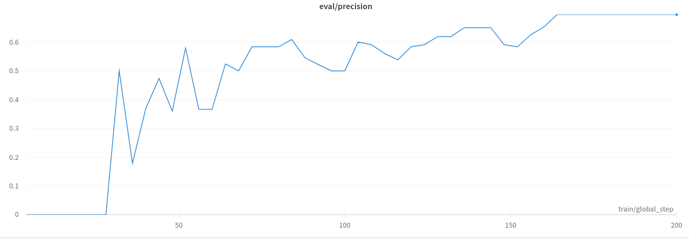
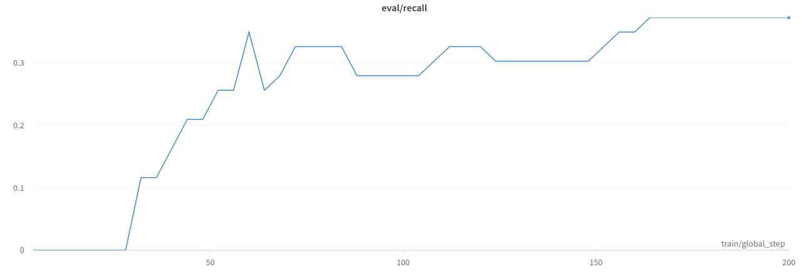
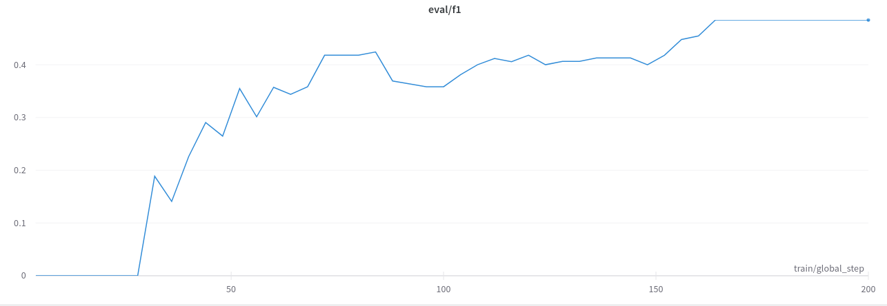
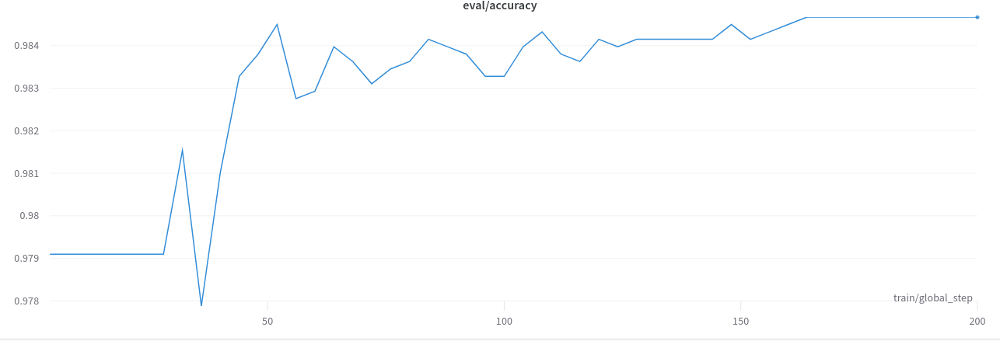

# BERT ML task

## Table of Contents
1. [Framing the Problem](#framing-the-problem)
   - [Inputs](#inputs)
   - [Main Challenges](#main-challenges)
2. [Solution](#solution)
   - [Dataset Generation](#dataset-generation)
   - [Model Fine-Tuning](#model-fine-tuning)
   - [Metrics](#metrics)
   - [Pipeline](#pipeline)
3. [Potential Improvements](#potential-improvements)
4. [Installation](#installation)
5. [Usage](#usage)

## Framing the Problem
<a name="framing-the-problem"></a>
The main goal is to extract the product names from arbitrary furniture store web pages. Since these product names often contain multiple words and can be located in different parts of the page, this is a challenging task. The solution should be able to handle a wide variety of web pages and product names.
Therefore, a regex based solution is not suitable. Instead, a machine learning approach is required.

### Inputs
<a name="inputs"></a>
The provided inputs are a list of URLs. These are sometimes outdated and either return a 404 or redirect to a different page. The solution should be able to handle these cases.

### Main Challenges
<a name="main-challenges"></a>
The main challenges are:
- The product names can be located in different parts of the page, such as the title, description, or breadcrumbs.
- The web pages can be structured in different ways.
- All HTML tags and additional noise should be removed before generating the dataset.
- Sometimes these web pages are longer than the context window of the model.

## Solution
<a name="solution"></a>
The solution is to use the BERT large language model on a dataset created by annotating the sanitized text extracted from the list of provided URLs. 
The model is fine-tuned on this dataset and then used to extract the product names from the web pages.

### Dataset Generation
<a name="dataset-generation"></a>
The first step of the solution is to create a train and test dataset. For this reason I created a scraper, which handles the following cases:
- The URL produces a 404 error or the content is empty.
- Leverages the BeautifulSoup library to extract the text from the HTML and strip any unnecessary tags.
- Saves the sanitized text to a file.

The next step is to split the text into tokens and set a default label for all tokens. This is the input expected by BERT.
This is then saved following an 80/20 split and ready for manual annotation. 

Since we only have one class, the annotation is done by marking the product names with the `B-PRODUCT` and `I-PRODUCT` labels.

I've included a **sample** of how the dataset looks like after annotation. The dataset I used for fine-tuning consists of 57 files for the train dataset and 12 for the test.


### Model Fine-Tuning
<a name="model-fine-tuning"></a>
Fine-tuning the BERT model was done within the Huggingface framework. The model has a context window of 512 tokens. This is sometimes not enough for some web pages.
However, after annotating the dataset, I found that the product names are usually within the first 512 tokens. I've described a potential improvement in the section below, where tokens are split so the full page can be processed.

The model was fine-tuned for 50 epochs with a batch size of 4. 

### Metrics
<a name="metrics"></a>
The metrics chosen are precision, recall, F1 score and accuracy. Below is a brief description of each metric:
- Precision: The number of correctly predicted product names divided by the total number of predicted product names.
- Recall: The number of correctly predicted product names divided by the total number of product names.
- F1 score: The harmonic mean of precision and recall.
- Accuracy: The number of correctly predicted product names divided by the total number of tokens.

Below are the diagrams of the evaluation metrics for the test dataset.







### Pipeline
<a name="pipeline"></a>
For inferencing from a URL, I've created a pipeline which scrapes the web page, tokenizes it with truncation and converts the predictions to readable product names.
The pipeline is usable via the command line and is described in the usage section below.

## Potential Improvements
<a name="potential-improvements"></a>
The most significant one would be to create a larger dataset. Due to time constraints the one I created was very limited, yet the model still performed reasonably well.
Another improvement is to tokenize the whole text and split it into chunks of 512 tokens. The way to do this is to use the tokenizer without truncation and special tokens.
Afterwards we need to add special tokens manually at the beginning and end, manually pad the chunks to 512 if needed and then stack the tensors.


## Installation
<a name="installation"></a>

Install the requirements (optionally within a virtualenv):

```bash
# Create a virtualenv
python -m venv /path/to/new/virtual/environment
source /path/to/new/virtual/environment/bin/activate

# Install the requirements
pip install -r requirements.txt
```

## Usage
<a name="usage"></a>

Run the script within the virtualenv:

```bash
python inference_pipeline.py --url http://www.example.com
```
